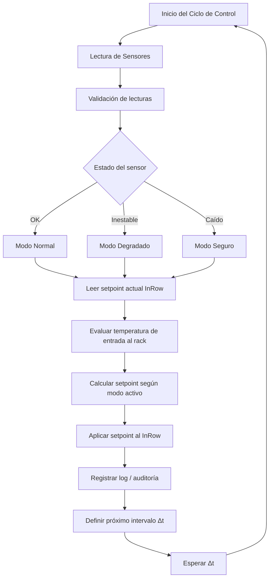

# Sistema Autónomo de Refrigeración Inteligente para PODs de Data Center

---

## Introducción

Este proyecto propone un **sistema autónomo y automático de control térmico** para PODs de Data Center, tanto **confinados** (CAC / HAC) como  **no confinados** , orientado a:

* Proteger la carga IT
* Optimizar el consumo energético
* Mantener continuidad operativa ante fallas
* Reducir la intervención manual

El sistema está diseñado para controlar  **4 unidades InRow** , cada una refrigerando  **3 racks** , utilizando sensores críticos de temperatura de entrada ( **INLET** ) y sensores de contexto según el escenario operativo.

---

## Objetivos del sistema

* Mantener la temperatura de entrada al rack dentro de un rango óptimo
* Ajustar automáticamente los setpoints de las unidades InRow
* Adaptar dinámicamente el intervalo de control según la criticidad térmica
* Detectar fallas de sensores y operar de forma segura
* Emitir alertas ante condiciones anómalas
* Funcionar como una  **política automática** , no como un simple script

---

## Arquitectura conceptual del sistema

### Ciclo operativo continuo

El sistema opera bajo un  **loop de control autónomo** , que  **nunca se detiene** .

Ante eventos anómalos, cambia su  **modo de operación** , no su ejecución.

**Estados posibles:**

* 🟢 **Modo Normal** → Control fino y eficiente
* 🟡 **Modo Degradado** → Control conservador
* 🔴 **Modo Seguro** → Prioridad operativa
* 

## Diagrama del Ciclo de Control Autónomo

El siguiente diagrama representa el ciclo completo de control térmico del sistema,
incluyendo validación de sensores, modos operativos y toma de decisiones.

---

## Sensores y criterios de medición

### Sensor crítico

* **Temperatura de entrada al rack (INLET)**

  Es el sensor principal sobre el cual se toman todas las decisiones de control térmico.

### Sensores de contexto (según escenario)

* Ambiente (CAC / sin confinamiento)
* Pasillo caliente (HAC)
* Estado de puertas de confinamiento

> **Importante**
>
> La temperatura del aire caliente es informativa, pero **nunca reemplaza** la temperatura de entrada al rack como variable de control.

---

## Gestión inteligente de fallas de sensores

El sistema  **no reacciona ante una única lectura inválida** .

### Política de validación

* Cada sensor posee un contador de fallas consecutivas
* Una lectura válida reinicia el contador
* Al superar un umbral:
  * El sensor se marca como no confiable
  * Se genera una alerta
  * El sistema entra en **modo seguro**

### Esto evita:

* Oscilaciones innecesarias
* Falsas alarmas
* Ajustes térmicos peligrosos

---

## Lógica general de control térmico

1. Se leen los sensores
2. Se valida la calidad de las lecturas
3. Se determina el estado operativo
4. Se calcula el setpoint adecuado
5. Se aplica el setpoint al InRow
6. Se define el próximo intervalo de control
7. Se registra todo para auditoría

---

## Fragmentos clave del código (explicados)

### Configuración general del sistema

<pre class="overflow-visible! px-0!" data-start="4101" data-end="4456">

<code class="whitespace-pre! language-python"># 🎯 OBJETIVOS TÉRMICOS
TEMPERATURA_OBJETIVO = 22.0
BANDA_MUERTA = 0.5

# 🔒 LÍMITES OPERATIVOS
SETPOINT_MINIMO = 17.0
SETPOINT_MAXIMO = 25.0

# ⏱️ INTERVALOS DE CONTROL
INTERVALO_NORMAL = 20 * 60
INTERVALO_ALERTA = 5 * 60
INTERVALO_CRITICO = 2 * 60

# 🔧 AJUSTES
AJUSTE_SUAVE = 0.5
AJUSTE_RAPIDO = 1.0

# 🏗️ ESCENARIO
ESCENARIO_POD = "HAC"
</code>

</pre>

---

### Lectura del sensor crítico (INLET)

<pre class="overflow-visible! px-0!" data-start="4629" data-end="4783">

<code class="whitespace-pre! language-python">defleer_sensor_inlet(inrow_id):
    """
    Lee la temperatura de entrada de aire al rack.
    Sensor CRÍTICO del sistema.
    """
    pass
</code>

</pre>

**Concepto**

Mide la temperatura real que recibe la carga IT.

Es la referencia principal del sistema.

---

### Sensor de contexto

<pre class="overflow-visible! px-0!" data-start="4927" data-end="5118">

<code class="whitespace-pre! language-python">defleer_sensor_contexto(inrow_id):
    """
    Sensores complementarios según escenario:
    - CAC → Ambiente
    - HAC → Pasillo caliente
    - SIN → Ambiente
    """
    pass
</code>

</pre>

**Concepto**

Aporta diagnóstico y contexto, pero **no gobierna** el control.

---

### Estado del confinamiento

<pre class="overflow-visible! px-0!" data-start="5241" data-end="5403">

<code class="whitespace-pre! language-python">defpuertas_confinamiento_cerradas():
    """
    Verifica si las puertas del confinamiento están cerradas.
    Aplica a CAC / HAC.
    """
    pass
</code>

</pre>

**Concepto**

El sistema considera variables físicas reales del entorno.

---

### Función central de control

<pre class="overflow-visible! px-0!" data-start="5523" data-end="5772">

<code class="whitespace-pre! language-python">defevaluar_y_controlar_inrow(inrow_id):
    """
    Función principal del sistema:
    - Lee sensores
    - Valida datos
    - Define modo operativo
    - Calcula y aplica setpoint
    - Ajusta el intervalo de control
    """
    pass
</code>

</pre>

**Concepto**

Esta función representa la  **política automática de refrigeración** .

---

## Modo seguro operativo

Ante fallas persistentes:

* Se fija un setpoint conservador
* Se prioriza la protección de la carga IT
* El sistema sigue operando

Ejemplo:

> Setpoint fijo en 20 °C hasta restaurar sensores confiables.

---

## Beneficios del sistema

✔ Reducción de riesgo térmico

✔ Menor intervención humana

✔ Mayor eficiencia energética

✔ Resiliencia ante fallas

✔ Escalabilidad

✔ Auditoría y trazabilidad

---

## Conclusión

Este proyecto no busca solo automatizar equipos, sino  **establecer una política autónoma de refrigeración** , capaz de adaptarse al contexto real del Data Center.

> **La automatización no reemplaza al operador: le devuelve control estratégico.**
>
> **El sistema no automatiza equipos. Automatiza decisiones.**

---

## Mejoras y Próximos pasos

* Integración con DCIM
* Alertas reales (Mail / Teams / WhatsApp)
* Históricos y dashboards
* Predicción térmica (ML)
